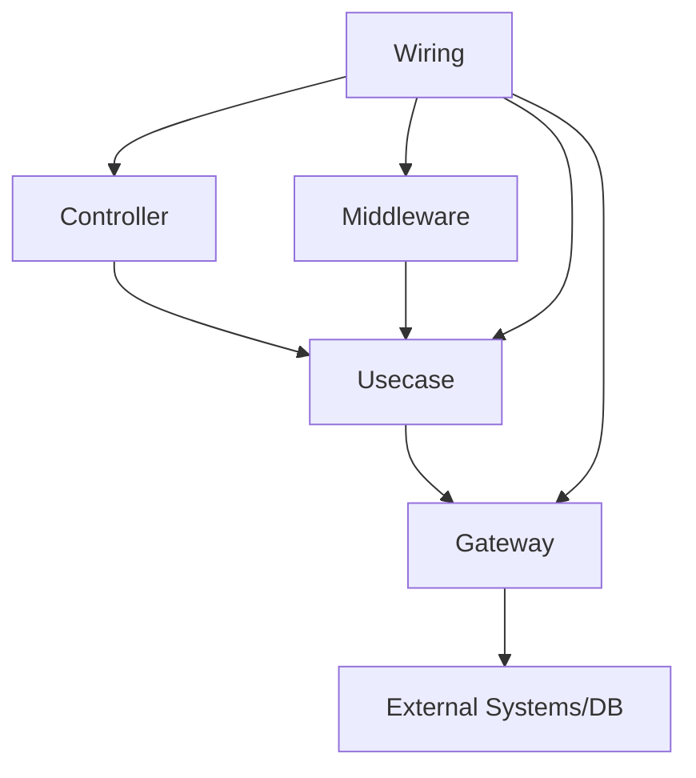

# Main Rules

## IMPORTANT: READ BEFORE IMPLEMENTATION
This document provides an overview. You MUST follow the specific reference documents when implementing any component. Each document contains essential patterns, rules, and code styles that MUST be followed exactly.

## Terminology
- **Controller**: Exposes usecases via protocols (HTTP, MQTT, schedulers, etc.)
- **Usecase**: Pure business logic, orchestrates gateways, no infrastructure dependencies
- **Gateway**: Handles infrastructure and non-deterministic functions
- **Middleware**: Decorators for cross-cutting concerns (transactions, logging, etc.)
- **Wiring**: Dependency injection and component composition

## Architecture Diagram



## Structure
```
├── controller/ # Exposes usecases to the world
├── core/       # Contains ActionHandler definition
├── gateway/    # External interfaces and system utilities
├── middleware/ # Cross-cutting concerns (transaction, logging, retry)
├── model/      # Domain entities
├── usecase/    # Business logic
├── utils/      # Helper functions
└── wiring/     # Connects components
```

## MANDATORY DEVELOPMENT WORKFLOW
1. **Analyze requirements** thoroughly

2. **Read core documentation**
   - `01-core-components.md` to understand ActionHandler, Gateway, and Usecase patterns

3. **Scan crucial existing code**
   - Scan ALL files in `/model/*` to understand domain entities
   - Scan `/gateway/gateway.go` for existing gateway type definitions
   - Scan ALL files in `/middleware/*` to understand available middleware
   - Scan ALL files in `/wiring/*` to understand current component integration

4. **Plan implementation strategy**
   - List components that can be reused without modification
   - List components that need to be created
   - Identify any existing components that need modification

5. **Check module imports**
   - Review `go.mod` to determine the correct import path for project modules

6. **Implement components**
   - **Prefer reusing existing components** whenever possible
   - If modifications to domain models are needed: Follow guidance in documentation
   - If new gateways are needed: Follow `01-core-components.md` gateway section
   - If new usecases are needed: Follow `01-core-components.md` usecase section
   - If new controllers are needed: Follow `03-controller.md`
   - When applying middleware: Follow `04-middleware.md`
   - For component integration: Follow `05-wiring.md`

7. **Implement unit tests**
   - For usecases: Follow `02-usecase-test.md` guidelines
   - Create comprehensive test coverage for all business logic
   - Use mocking for all gateway dependencies
   - Test both success and error paths

8. **Run code validation**
   ```
   $ go mod tidy
   $ go vet ./...
   $ go test ./...
   ```
   - Run these commands to check for potential errors and run unit tests
   - If errors are found, solve them before proceeding
   - Ensure all tests pass with expected coverage
   - Repeat this process until no errors are detected and all tests pass

## STOP AND ASK When:
- Modifying existing models or gateway definitions
- Planning structural changes
- Requirements are ambiguous
- Documentation patterns are unclear