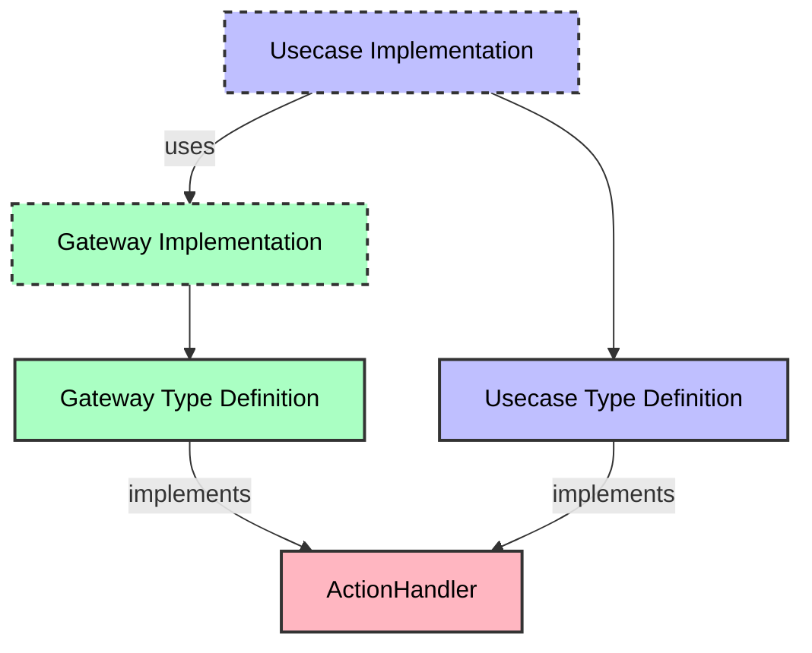
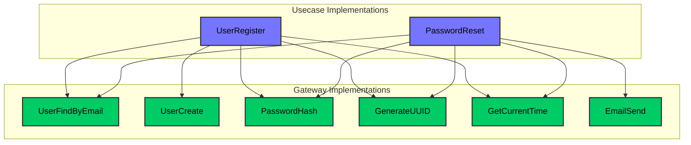

# Core Components: ActionHandler, Gateway, and Usecase

## 1. Overview
This document describes the core components that form the foundation of the Clean Architecture implementation. After understanding the basic terminology in `00-main-rules.md`, this document provides detailed guidance on implementing the ActionHandler pattern, Gateways, and Usecases. These components work together to create a system that's maintainable, testable, and aligned with clean architecture principles!



## 2. ActionHandler Pattern
The ActionHandler pattern provides a consistent type signature across all components, making the system more predictable and easier to understand.

```go
// In core/core.go
type ActionHandler[REQUEST any, RESPONSE any] func(ctx context.Context, request REQUEST) (*RESPONSE, error)
```

This generic typed function accepts a context and request object, and returns a pointer to a response object and an error. It serves as the foundational type for both Gateways and Usecases, enabling consistent patterns throughout the system.

The beauty of this pattern is that it:
- Creates a uniform interface for all operations
- Supports dependency injection
- Enables middleware application
- Makes testing straightforward
- Promotes clear separation of concerns

## 3. Component Structure

### 3.1 File Organization
- Type definitions are kept in a single file (`usecase.go` or `gateway.go`)
- Implementations are in separate files named by their function
- Each implementation file contains exactly one implementation function

### 3.2 Naming Conventions
Consistent naming is crucial for maintaining a clear and organized codebase.

#### 3.2.1 Gateway Naming
- Use technical/infrastructure terminology
- Format: `<Object><Action>` 
- Examples: `UserSave`, `UserFindOne`, `TodoCreate`, `MessagePublish`
- Filenames: `gateway_user_save.go`, `gateway_todo_create.go`

#### 3.2.2 Usecase Naming
- Use business process terminology
- Format: `<Object><Action>`
- Examples: `UserRegister`, `UserAuthenticate`, `OrderPlace`, `PaymentProcess`
- Filenames: `usecase_user_register.go`, `usecase_order_place.go`

### 3.3 Implementation Templates
These templates ensure consistency across all components.

#### 3.3.1 Type Definition Template
```go
// === === === === === === === === === === === === === === === ===

type <Object><Action>Req struct {
    // Request fields
}

type <Object><Action>Res struct {
    // Response fields
}

// <Object><Action> description about this gateway/usecase
type <Object><Action> = core.ActionHandler[<Object><Action>Req, <Object><Action>Res]

// === === === === === === === === === === === === === === === ===
```

#### 3.3.2 Function Implementation Template
```go
// Impl<Object><Action> implements the function with dependencies
func Impl<Object><Action>(
    // Dependencies are injected here
    // ...
) <Object><Action> {
    return func(ctx context.Context, req <Object><Action>Req) (*<Object><Action>Res, error) {
        // Implementation goes here
        
        // ALWAYS return a pointer to response, never the value directly
        return &<Object><Action>Res{
            // Response fields
        }, nil
    }
}
```

### 3.4 Gateway-Usecase Relationship
Usecases orchestrate multiple gateways to implement business processes. The diagram below shows how multiple usecases can share gateway implementations:



Notice how both usecases share common gateways like `UserFindByEmail`, `PasswordHash`, `GenerateUUID`, and `GetCurrentTime`. This promotes reuse and consistency across the application!

## 4. Gateway Component
Gateways handle all infrastructure concerns and non-deterministic operations, acting as the boundary between the clean domain logic and the messy outside world!

### 4.1 Core Principles
1. **Infrastructure Focus**: Gateways handle external systems and side-effects
2. **Single Responsibility**: Each gateway performs one specific operation
3. **Error Handling**: Gateways properly handle and wrap infrastructure errors
4. **Pure Infrastructure**: No business logic belongs in gateways

### 4.2 Gateway Categories
- **Domain Gateways**: Operations on domain entities (e.g., `UserSave`, `TodoCreate`)
- **System Utilities**: System-level operations (e.g., `SystemGenerateUUID`, `SystemGetCurrentTime`)

### 4.3 Gateway Responsibilities
1. Database operations
2. API calls
3. File system access
4. Non-deterministic operations (timestamps, UUIDs, random values)
5. Any operation with side effects

### 4.4 Implementation Examples

#### 4.4.1 Domain Gateway Example
```go
// In gateway_user_find_by_email.go
package gateway

import (
    "context"
    "fmt"
    
    "project/middleware"
    "gorm.io/gorm"
)

func ImplUserFindByEmail(db *gorm.DB) UserFindByEmail {
    return func(ctx context.Context, req UserFindByEmailReq) (*UserFindByEmailRes, error) {
        // Get transaction-aware DB connection
        dbCtx := middleware.GetDBFromContext(ctx, db)
        
        var user model.User
        result := dbCtx.Where("email = ?", req.Email).First(&user)
        
        if result.Error != nil {
            if result.Error == gorm.ErrRecordNotFound {
                return &UserFindByEmailRes{
                    Exists: false,
                    User:   nil,
                }, nil
            }
            return nil, fmt.Errorf("database error: %w", result.Error)
        }
        
        return &UserFindByEmailRes{
            Exists: true,
            User:   &user,
        }, nil
    }
}
```

#### 4.4.2 System Utility Example
```go
// In gateway_system_generate_uuid.go
func ImplSystemGenerateUUID() SystemGenerateUUID {
    return func(ctx context.Context, req SystemGenerateUUIDReq) (*SystemGenerateUUIDRes, error) {
        uuid := uuid.New().String()
        return &SystemGenerateUUIDRes{
            UUID: uuid,
        }, nil
    }
}
```

### 4.5 Rules

#### 4.5.1 Required Practices
- **ONE TASK PER GATEWAY**: Each gateway should do one specific operation (Single Responsibility)
- **USE TRANSACTION MIDDLEWARE**: Always use `middleware.GetDBFromContext(ctx, db)` for DB operations
- **WRAP ERRORS**: Always wrap errors with context using `fmt.Errorf("failed to...: %w", err)`
- **RETURN POINTERS**: Always return a pointer to the response, never the value directly
- **HANDLE INFRASTRUCTURE ERRORS**: Convert infrastructure errors to appropriate domain errors

#### 4.5.2 Prohibited Practices
- **NO BUSINESS LOGIC**: Gateways should never contain business rules or decisions
- **NO USECASE ACCESS**: Gateways should never access usecases
- **NO DIRECT ERROR RETURN**: Never return database/API errors directly without wrapping
- **NO HARDCODED VALUES**: Never hardcode values that should be parameters
- **NO GATEWAY CHAINING**: Never call other gateways from a gateway

## 5. Usecase Component
Usecases contain the heart of your application: the business logic! They orchestrate gateways to implement business processes, but remain pure and free from infrastructure concerns.

### 5.1 Core Principles
1. **Pure Business Logic**: Usecases contain only business rules and process logic
2. **Independent Transactions**: Each usecase represents a single business transaction
3. **No Infrastructure Access**: Usecases never directly access databases, APIs or external systems
4. **Gateway Orchestration**: Usecases coordinate multiple gateways to complete business processes
5. **Input Validation**: Usecases are responsible for validating all inputs

### 5.2 Business Logic Flow
A typical usecase follows this flow pattern:
1. **Input Validation**: Validate all request fields
2. **Business Rules Check**: Ensure the request meets business rules
3. **Data Retrieval**: Get any necessary data from gateways
4. **Process Logic**: Apply business logic to transform data
5. **Infrastructure Operations**: Execute infrastructure operations via gateways
6. **Result Composition**: Build and return response

### 5.3 Implementation Example
```go
// In usecase_user_register.go
func ImplUserRegister(
    userFindByEmail gateway.UserFindByEmail,
    passwordHash gateway.PasswordHash,
    systemGenerateUUID gateway.SystemGenerateUUID,
    systemGetCurrentTime gateway.SystemGetCurrentTime,
    userCreate gateway.UserCreate,
) UserRegister {
    return func(ctx context.Context, req UserRegisterReq) (*UserRegisterRes, error) {
        // 1. Input Validation
        if req.Email == "" {
            return nil, errors.New("email is required")
        }
        if req.Password == "" {
            return nil, errors.New("password is required")
        }
        if len(req.Password) < 8 {
            return nil, errors.New("password must be at least 8 characters")
        }
        
        // 2. Business Rules Check - Check if user already exists
        existsRes, err := userFindByEmail(ctx, gateway.UserFindByEmailReq{
            Email: req.Email,
        })
        if err != nil {
            return nil, fmt.Errorf("failed to check email existence: %w", err)
        }
        if existsRes.Exists {
            return nil, errors.New("email already registered")
        }
        
        // 3. Process Logic - Hash password
        hashRes, err := passwordHash(ctx, gateway.PasswordHashReq{
            Password: req.Password,
        })
        if err != nil {
            return nil, fmt.Errorf("failed to hash password: %w", err)
        }
        
        // 4. Get UUID and current time
        uuidRes, err := systemGenerateUUID(ctx, gateway.SystemGenerateUUIDReq{})
        if err != nil {
            return nil, fmt.Errorf("failed to generate UUID: %w", err)
        }
        
        timeRes, err := systemGetCurrentTime(ctx, gateway.SystemGetCurrentTimeReq{})
        if err != nil {
            return nil, fmt.Errorf("failed to get current time: %w", err)
        }
        
        // 5. Infrastructure Operations - Create user
        _, err = userCreate(ctx, gateway.UserCreateReq{
            ID:           uuidRes.UUID,
            Email:        req.Email,
            PasswordHash: hashRes.HashedPassword,
            Name:         req.Name,
            CreatedAt:    timeRes.Now,
        })
        if err != nil {
            return nil, fmt.Errorf("failed to create user: %w", err)
        }
        
        // 6. Result Composition
        return &UserRegisterRes{
            UserID: uuidRes.UUID,
        }, nil
    }
}
```
Notice how the example follows the Business Logic Flow from start to finish!

### 5.4 Rules

#### 5.4.1 Required Practices
- **PURE FUNCTIONS**: Implement usecases as pure functions without side effects
- **BUSINESS TERMS**: Use business terminology, not technical terms, in naming
- **VALIDATION**: Validate all inputs at the beginning of the usecase
- **ERROR CONTEXT**: Wrap errors with contextual information
- **RETURN POINTERS**: Always return a pointer to the response, never the value directly

#### 5.4.2 Prohibited Practices
- **NO INFRASTRUCTURE ACCESS**: Never access databases or APIs directly
- **NO NON-DETERMINISTIC FUNCTIONS**: Never implement time.Now(), uuid.New() in usecases
- **NO ERROR IGNORING**: Never ignore errors returned from gateways
- **NO USECASE CALLS**: Never call other usecases from within a usecase
- **NO GLOBAL STATE**: Never use global state or singletons

## 6. Cross-Cutting Concerns

### 6.1 Transaction Management
Database transactions are critical for maintaining data consistency. For detailed implementation of transaction middleware, see `04-middleware.md`.

In gateway implementations, always retrieve the transaction-aware DB connection:

```go
// In any gateway that accesses the database
func ImplSomeDbOperation(db *gorm.DB) SomeDbOperation {
    return func(ctx context.Context, req SomeDbOperationReq) (*SomeDbOperationRes, error) {
        // Get transaction-aware DB connection
        dbCtx := middleware.GetDBFromContext(ctx, db)
        
        // Use dbCtx for all database operations
        // ...
    }
}
```

### 6.2 Error Handling
Proper error handling ensures that errors are meaningful and traceable:
- Always wrap errors with context using `fmt.Errorf("operation failed: %w", err)`
- Return appropriate error types that can be handled by the caller
- Never ignore errors from gateway calls

### 6.3 Context Propagation
Context is used for:
- Carrying request-scoped values (like transaction objects)
- Handling timeouts and cancellation
- Tracking request lifecycle

Always pass context from usecases to gateways to ensure proper propagation.

## 7. Integration Points
This document focuses on ActionHandler, Gateway, and Usecase implementations. For information on how these components interact with others in the system:

- **Controllers**: Refer to `03-controller.md` for how to expose usecases through different protocols
- **Middleware**: See `04-middleware.md` for implementing cross-cutting concerns
- **Wiring**: Check `05-wiring.md` for dependency injection and component composition

## 8. Development Workflow
When implementing new features using these components:

1. First identify the business requirements and model them as usecases
2. Determine what gateway operations are needed to support these usecases
3. Implement the gateways first, then the usecases that use them
4. Apply appropriate middleware (especially transaction middleware)
5. Finally, expose the usecases through controllers

### 8.1 Common Pitfalls to Avoid
1. **Mixing Business Logic and Infrastructure**: Keep usecases focused on business rules and gateways on infrastructure
2. **Direct Dependency Injection**: Always accept dependencies through constructor parameters
3. **Missing Error Handling**: Always handle and wrap errors with context
4. **Usecase Chaining**: Never call usecases from within usecases; decompose into smaller usecases instead
5. **State Sharing**: Never use global variables or state; pass all data explicitly

## 9. When To Seek Help

### 9.1 STOP AND ASK When:
- You need to modify existing model or gateway definitions
- You're unsure about the proper separation between usecase and gateway responsibilities
- Requirements are ambiguous
- You need to implement non-deterministic operations in usecases
- You're considering calling one usecase from another

### 9.2 Team Support
Remember that the architecture is designed to make development more straightforward, not more complex. If something seems overly complicated, it might be a sign that there's a simpler approach within the architecture - reach out to your team!
