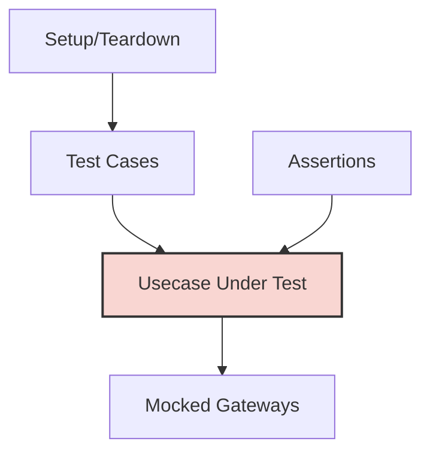

# Unit Testing for Usecases

## Overview
This document provides standardized patterns for testing usecases in the Clean Architecture implementation. Effective testing is crucial for maintaining code quality and reliability. This guide focuses specifically on unit testing strategies for usecases, complementing the information in `01-core-components.md`.



## Core Testing Principles

### ✅ REQUIRED
- Test each usecase in isolation from infrastructure
- Mock all gateway dependencies with predictable behavior
- Test both success paths and error paths
- Structure tests consistently using table-driven approach
- Test all validation rules and business logic
- Use descriptive test names that explain the scenario
- Maintain test code with the same quality standards as production code

### ❌ FORBIDDEN
- NEVER test usecases with real infrastructure dependencies
- NEVER skip testing error scenarios and edge cases
- NEVER use global state in tests
- NEVER create complex test setups that make test intent unclear
- NEVER rely on execution order between tests

## Test Structure

### File Naming Convention
- Test files should be named after the usecase file with `_test` suffix
- Example: For `usecase_user_register.go` → `usecase_user_register_test.go`

### Test Function Naming Convention
- Test functions should follow `Test[UsecaseName]_[Scenario]` pattern
- Example: `TestUserRegister_ValidInput`, `TestUserRegister_EmailAlreadyExists`

## Mock Implementation Strategy

### Gateway Mocking Pattern
Use functional mocking approach to create predictable gateway behavior:

```go
// Gateway mock implementation for testing
func mockUserFindByEmail(exists bool, err error) gateway.UserFindByEmail {
    return func(ctx context.Context, req gateway.UserFindByEmailReq) (*gateway.UserFindByEmailRes, error) {
        if err != nil {
            return nil, err
        }
        
        return &gateway.UserFindByEmailRes{
            Exists: exists,
            User: exists ? &model.User{
                Email: req.Email,
                // Set other user fields as needed
            } : nil,
        }, nil
    }
}
```

### System Gateway Mocking
For non-deterministic operations, create mocks that return consistent values:

```go
// System gateway mock for deterministic testing
func mockSystemGenerateUUID(uuid string) gateway.SystemGenerateUUID {
    return func(ctx context.Context, req gateway.SystemGenerateUUIDReq) (*gateway.SystemGenerateUUIDRes, error) {
        return &gateway.SystemGenerateUUIDRes{
            UUID: uuid,
        }, nil
    }
}

func mockSystemGetCurrentTime(timeValue time.Time) gateway.SystemGetCurrentTime {
    return func(ctx context.Context, req gateway.SystemGetCurrentTimeReq) (*gateway.SystemGetCurrentTimeRes, error) {
        return &gateway.SystemGetCurrentTimeRes{
            Now: timeValue,
        }, nil
    }
}
```

## Table-Driven Test Pattern

### Basic Structure

```go
func TestSomeUsecase_Scenarios(t *testing.T) {
    // Define fixed test values
    fixedUUID := "test-uuid-12345"
    fixedTime := time.Date(2023, 1, 1, 12, 0, 0, 0, time.UTC)
    
    // Define test cases
    tests := []struct {
        name          string
        request       usecase.SomeUsecaseReq
        setupMocks    func() (usecase.SomeUsecase, []*mock.Mock)
        expectedRes   *usecase.SomeUsecaseRes
        expectedError string
    }{
        {
            name: "Success case",
            request: usecase.SomeUsecaseReq{
                // Request fields
            },
            setupMocks: func() (usecase.SomeUsecase, []*mock.Mock) {
                // Setup all required mocks for this test case
                return usecase.ImplSomeUsecase(
                    // Pass mock gateways with expected behavior
                ), nil
            },
            expectedRes: &usecase.SomeUsecaseRes{
                // Expected response fields
            },
            expectedError: "",
        },
        {
            name: "Error case - validation fails",
            request: usecase.SomeUsecaseReq{
                // Invalid request fields
            },
            setupMocks: func() (usecase.SomeUsecase, []*mock.Mock) {
                return usecase.ImplSomeUsecase(
                    // Pass mock gateways
                ), nil
            },
            expectedRes:   nil,
            expectedError: "validation error message",
        },
        // Additional test cases...
    }
    
    // Execute test cases
    for _, tt := range tests {
        t.Run(tt.name, func(t *testing.T) {
            // Setup mocks
            usecaseFunc, mocks := tt.setupMocks()
            
            // Execute usecase
            result, err := usecaseFunc(context.Background(), tt.request)
            
            // Check error
            if tt.expectedError != "" {
                assert.Error(t, err)
                assert.Contains(t, err.Error(), tt.expectedError)
                return
            }
            
            // Check success result
            assert.NoError(t, err)
            assert.Equal(t, tt.expectedRes, result)
            
            // Verify mock expectations if using a mocking library
            if mocks != nil {
                for _, m := range mocks {
                    m.AssertExpectations(t)
                }
            }
        })
    }
}
```

## Testing Success Paths

Success path tests verify that the usecase functions correctly under normal conditions.

### Success Path Considerations
- Test all business rules are properly applied
- Verify expected gateway calls are made in the correct order
- Confirm response contains all expected data
- Ensure proper data transformations have been applied

### Example: Testing User Registration Success

```go
func TestUserRegister_Success(t *testing.T) {
    // Fixed test values
    expectedUUID := "test-user-uuid"
    fixedTime := time.Date(2023, 1, 1, 12, 0, 0, 0, time.UTC)
    hashedPassword := "hashed-password-value"
    
    // Test request
    req := usecase.UserRegisterReq{
        Email:    "test@example.com",
        Password: "securepassword123",
        Name:     "Test User",
    }
    
    // Mock gateways
    mockFindByEmail := mockUserFindByEmail(false, nil) // User doesn't exist
    mockPasswordHash := func(ctx context.Context, req gateway.PasswordHashReq) (*gateway.PasswordHashRes, error) {
        return &gateway.PasswordHashRes{HashedPassword: hashedPassword}, nil
    }
    mockGenerateUUID := mockSystemGenerateUUID(expectedUUID)
    mockGetCurrentTime := mockSystemGetCurrentTime(fixedTime)
    mockCreateUser := func(ctx context.Context, req gateway.UserCreateReq) (*gateway.UserCreateRes, error) {
        // Validate inputs
        assert.Equal(t, expectedUUID, req.ID)
        assert.Equal(t, "test@example.com", req.Email)
        assert.Equal(t, hashedPassword, req.PasswordHash)
        assert.Equal(t, "Test User", req.Name)
        assert.Equal(t, fixedTime, req.CreatedAt)
        
        return &gateway.UserCreateRes{}, nil
    }
    
    // Instantiate usecase with mocks
    registerUsecase := usecase.ImplUserRegister(
        mockFindByEmail,
        mockPasswordHash,
        mockGenerateUUID,
        mockGetCurrentTime,
        mockCreateUser,
    )
    
    // Execute usecase
    result, err := registerUsecase(context.Background(), req)
    
    // Assert results
    assert.NoError(t, err)
    assert.NotNil(t, result)
    assert.Equal(t, expectedUUID, result.UserID)
}
```

## Testing Error Paths

Error path tests verify that the usecase handles failures and edge cases correctly.

### Categories of Error Tests
1. **Input Validation Errors**: Missing or invalid fields
2. **Business Rule Violations**: Business constraints not met
3. **Gateway Failures**: Internal or external services failing
4. **Concurrency Issues**: Race conditions or conflicts

### Example: Testing Validation Errors

```go
func TestUserRegister_ValidationErrors(t *testing.T) {
    tests := []struct {
        name          string
        req           usecase.UserRegisterReq
        expectedError string
    }{
        {
            name: "Empty Email",
            req: usecase.UserRegisterReq{
                Email:    "",
                Password: "securepassword123",
                Name:     "Test User",
            },
            expectedError: "email is required",
        },
        {
            name: "Empty Password",
            req: usecase.UserRegisterReq{
                Email:    "test@example.com",
                Password: "",
                Name:     "Test User",
            },
            expectedError: "password is required",
        },
        {
            name: "Password Too Short",
            req: usecase.UserRegisterReq{
                Email:    "test@example.com",
                Password: "short",
                Name:     "Test User",
            },
            expectedError: "password must be at least 8 characters",
        },
    }
    
    for _, tt := range tests {
        t.Run(tt.name, func(t *testing.T) {
            // Create usecase with minimal mocks (validation happens before gateway calls)
            registerUsecase := usecase.ImplUserRegister(
                nil, // We don't expect these to be called for validation errors
                nil,
                nil,
                nil,
                nil,
            )
            
            // Execute usecase
            result, err := registerUsecase(context.Background(), tt.req)
            
            // Assert error
            assert.Error(t, err)
            assert.Contains(t, err.Error(), tt.expectedError)
            assert.Nil(t, result)
        })
    }
}
```

### Example: Testing Business Rule Errors

```go
func TestUserRegister_EmailAlreadyExists(t *testing.T) {
    // Mock findByEmail to return user exists
    mockFindByEmail := mockUserFindByEmail(true, nil) // User already exists
    
    // Instantiate usecase with only the necessary mocks
    registerUsecase := usecase.ImplUserRegister(
        mockFindByEmail,
        nil, // We don't expect these to be called after the business rule check fails
        nil,
        nil,
        nil,
    )
    
    // Execute usecase
    req := usecase.UserRegisterReq{
        Email:    "existing@example.com",
        Password: "securepassword123",
        Name:     "Test User",
    }
    
    result, err := registerUsecase(context.Background(), req)
    
    // Assert error
    assert.Error(t, err)
    assert.Contains(t, err.Error(), "email already registered")
    assert.Nil(t, result)
}
```

### Example: Testing Gateway Failures

```go
func TestUserRegister_GatewayFailures(t *testing.T) {
    // Fixed mock values
    expectedUUID := "test-user-uuid"
    fixedTime := time.Date(2023, 1, 1, 12, 0, 0, 0, time.UTC)
    
    tests := []struct {
        name          string
        setupMocks    func() usecase.UserRegister
        expectedError string
    }{
        {
            name: "FindByEmail Gateway Failure",
            setupMocks: func() usecase.UserRegister {
                return usecase.ImplUserRegister(
                    mockUserFindByEmail(false, errors.New("database connection error")),
                    nil, // Other mocks not expected to be called
                    nil,
                    nil,
                    nil,
                )
            },
            expectedError: "failed to check email existence",
        },
        {
            name: "PasswordHash Gateway Failure",
            setupMocks: func() usecase.UserRegister {
                mockFindByEmail := mockUserFindByEmail(false, nil) // User doesn't exist
                mockPasswordHash := func(ctx context.Context, req gateway.PasswordHashReq) (*gateway.PasswordHashRes, error) {
                    return nil, errors.New("hashing service unavailable")
                }
                
                return usecase.ImplUserRegister(
                    mockFindByEmail,
                    mockPasswordHash,
                    nil, // Other mocks not expected to be called
                    nil,
                    nil,
                )
            },
            expectedError: "failed to hash password",
        },
        {
            name: "UserCreate Gateway Failure",
            setupMocks: func() usecase.UserRegister {
                mockFindByEmail := mockUserFindByEmail(false, nil) // User doesn't exist
                mockPasswordHash := func(ctx context.Context, req gateway.PasswordHashReq) (*gateway.PasswordHashRes, error) {
                    return &gateway.PasswordHashRes{HashedPassword: "hashed-password"}, nil
                }
                mockGenerateUUID := mockSystemGenerateUUID(expectedUUID)
                mockGetCurrentTime := mockSystemGetCurrentTime(fixedTime)
                mockCreateUser := func(ctx context.Context, req gateway.UserCreateReq) (*gateway.UserCreateRes, error) {
                    return nil, errors.New("database insert failed")
                }
                
                return usecase.ImplUserRegister(
                    mockFindByEmail,
                    mockPasswordHash,
                    mockGenerateUUID,
                    mockGetCurrentTime,
                    mockCreateUser,
                )
            },
            expectedError: "failed to create user",
        },
    }
    
    for _, tt := range tests {
        t.Run(tt.name, func(t *testing.T) {
            // Get usecase with configured mocks
            registerUsecase := tt.setupMocks()
            
            // Execute usecase
            req := usecase.UserRegisterReq{
                Email:    "test@example.com",
                Password: "securepassword123",
                Name:     "Test User",
            }
            
            result, err := registerUsecase(context.Background(), req)
            
            // Assert error
            assert.Error(t, err)
            assert.Contains(t, err.Error(), tt.expectedError)
            assert.Nil(t, result)
        })
    }
}
```

## Testing with Third-Party Mocking Libraries

While functional mocks are simple and effective, third-party mocking libraries can provide additional capabilities for complex scenarios.

### Using Testify/Mock

```go
import (
    "testing"
    "github.com/stretchr/testify/mock"
)

// Create a mock type for the gateway
type MockUserGateway struct {
    mock.Mock
}

// Implement gateway interfaces
func (m *MockUserGateway) FindByEmail(ctx context.Context, req gateway.UserFindByEmailReq) (*gateway.UserFindByEmailRes, error) {
    args := m.Called(ctx, req)
    if args.Get(0) == nil {
        return nil, args.Error(1)
    }
    return args.Get(0).(*gateway.UserFindByEmailRes), args.Error(1)
}

func (m *MockUserGateway) Create(ctx context.Context, req gateway.UserCreateReq) (*gateway.UserCreateRes, error) {
    args := m.Called(ctx, req)
    if args.Get(0) == nil {
        return nil, args.Error(1)
    }
    return args.Get(0).(*gateway.UserCreateRes), args.Error(1)
}

// Test using the mock
func TestUserRegister_WithMockLibrary(t *testing.T) {
    // Create mocks
    mockFindEmail := new(MockUserGateway)
    mockCreateUser := new(MockUserGateway)
    
    // Set expectations
    mockFindEmail.On("FindByEmail", mock.Anything, mock.MatchedBy(func(req gateway.UserFindByEmailReq) bool {
        return req.Email == "test@example.com"
    })).Return(&gateway.UserFindByEmailRes{Exists: false}, nil)
    
    mockCreateUser.On("Create", mock.Anything, mock.MatchedBy(func(req gateway.UserCreateReq) bool {
        return req.Email == "test@example.com" && req.PasswordHash == "hashed-password"
    })).Return(&gateway.UserCreateRes{ID: "user-123"}, nil)
    
    // Create usecase with mocks
    // ... (implementation specific to adapter pattern)
    
    // Execute test
    // ...
    
    // Verify all expectations were met
    mockFindEmail.AssertExpectations(t)
    mockCreateUser.AssertExpectations(t)
}
```

## Testing Context Handling

Ensure usecases properly respect context cancellation and timeouts.

```go
func TestUsecase_ContextCancellation(t *testing.T) {
    // Create a context that will be cancelled
    ctx, cancel := context.WithCancel(context.Background())
    
    // Setup mocks that check the context
    mockGateway := func(ctx context.Context, req gateway.SomeReq) (*gateway.SomeRes, error) {
        // Simulate a long operation
        cancel() // Cancel the context
        time.Sleep(10 * time.Millisecond)
        
        // Check if context was cancelled
        if ctx.Err() != nil {
            return nil, ctx.Err()
        }
        
        return &gateway.SomeRes{}, nil
    }
    
    // Initialize usecase with mocks
    someUsecase := usecase.ImplSomeUsecase(mockGateway)
    
    // Execute usecase with cancellable context
    result, err := someUsecase(ctx, usecase.SomeUsecaseReq{})
    
    // Assert
    assert.Error(t, err)
    assert.Contains(t, err.Error(), "context canceled")
    assert.Nil(t, result)
}
```

## Testing Middleware with Usecases

Test that middleware correctly wraps usecases and adds the expected behavior.

### Example: Testing Transaction Middleware

```go
func TestTransaction_CommitOnSuccess(t *testing.T) {
    // Create a mock database
    mockDB := &mockGorm{} // Custom mock implementation
    
    // Create a success usecase
    successUsecase := func(ctx context.Context, req struct{}) (*struct{}, error) {
        // Use GetDBFromContext to verify transaction was injected
        tx := middleware.GetDBFromContext(ctx, nil)
        assert.NotNil(t, tx)
        return &struct{}{}, nil
    }
    
    // Apply transaction middleware
    wrappedUsecase := middleware.Transaction(successUsecase, mockDB)
    
    // Execute wrapped usecase
    result, err := wrappedUsecase(context.Background(), struct{}{})
    
    // Assert results
    assert.NoError(t, err)
    assert.NotNil(t, result)
    
    // Verify that Commit was called but not Rollback
    assert.True(t, mockDB.CommitCalled)
    assert.False(t, mockDB.RollbackCalled)
}

func TestTransaction_RollbackOnError(t *testing.T) {
    // Create a mock database
    mockDB := &mockGorm{} // Custom mock implementation
    
    // Create a failing usecase
    failingUsecase := func(ctx context.Context, req struct{}) (*struct{}, error) {
        // Use GetDBFromContext to verify transaction was injected
        tx := middleware.GetDBFromContext(ctx, nil)
        assert.NotNil(t, tx)
        return nil, errors.New("business error")
    }
    
    // Apply transaction middleware
    wrappedUsecase := middleware.Transaction(failingUsecase, mockDB)
    
    // Execute wrapped usecase
    result, err := wrappedUsecase(context.Background(), struct{}{})
    
    // Assert results
    assert.Error(t, err)
    assert.Nil(t, result)
    
    // Verify that Rollback was called but not Commit
    assert.False(t, mockDB.CommitCalled)
    assert.True(t, mockDB.RollbackCalled)
}
```

## Integration with CI/CD

The test suite should be part of your continuous integration process.

### CI Configuration Recommendations
- Run all tests on each commit
- Enforce test coverage thresholds
- Generate test reports for review
- Include integration tests in addition to unit tests

### Example CI Configuration

```yaml
test:
  script:
    - go test -v -race -coverprofile=coverage.out ./...
    - go tool cover -html=coverage.out -o coverage.html
    - go tool cover -func=coverage.out
  artifacts:
    paths:
      - coverage.html
  coverage: '/total:\s+\(statements\)\s+(\d+.\d+)%/'
```

## Common Pitfalls in Usecase Testing

### 1. Over-mocking
- **Problem**: Creating complex mock setup that obscures test intent
- **Solution**: Mock only the boundaries, not internal implementations

### 2. Insufficient Error Testing
- **Problem**: Only testing happy paths
- **Solution**: Systematically test all error paths and edge cases

### 3. Brittle Tests
- **Problem**: Tests that break when implementation details change
- **Solution**: Test behavior, not implementation

### 4. Incomplete Validation Testing
- **Problem**: Missing tests for validation logic
- **Solution**: Test each validation rule individually

### 5. Ignoring Context Handling
- **Problem**: Not testing context propagation and cancellation
- **Solution**: Include specific tests for context behavior

## Recommended Testing Libraries

- **Assertion Libraries**:
  - [github.com/stretchr/testify/assert](https://github.com/stretchr/testify/assert) - Fluent assertions
  - [github.com/google/go-cmp](https://github.com/google/go-cmp) - Deep equality comparisons

- **Mocking Libraries**:
  - [github.com/stretchr/testify/mock](https://github.com/stretchr/testify/mock) - Object mocking
  - [github.com/golang/mock](https://github.com/golang/mock) - Interface mocking

- **Test Runners**:
  - [github.com/onsi/ginkgo](https://github.com/onsi/ginkgo) - BDD-style testing framework
  - Standard Go testing package

## STOP AND ASK When:
- You're unsure how to efficiently mock a complex dependency
- You need to test concurrent behavior
- You're testing usecases that depend on external state
- You need to verify sequence of operations
- You're experiencing complex test setup for seemingly simple usecases
