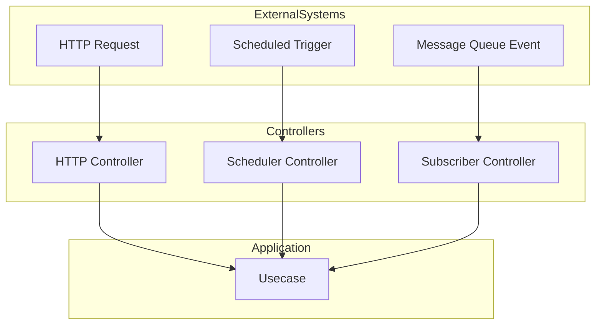

# Controller Implementation

## 1. Overview
Controllers expose usecases to the outside world through various protocols and mechanisms. They handle the translation between external requests and usecase inputs/outputs, but contain no business logic. This document covers all controller types: HTTP (read/write operations), scheduler-based, and message subscribers.



## 2. Core Controller Principles

### 2.1 Common Requirements
- **Usecase Focus**: One controller should call exactly ONE usecase
- **No Business Logic**: Controllers only handle protocol-specific concerns
- **Function-Based**: Use functions for controllers, not structs/interfaces
- **Dependency Injection**: Accept usecases as parameters
- **Error Handling**: Properly handle and report errors from usecases
- **Naming Convention**: Follow `<UsecaseName><ControllerType>Controller` pattern

### 2.2 Common Prohibitions
- **NO BUSINESS LOGIC**: Controllers should never contain business rules or decisions
- **NO INFRASTRUCTURE ACCESS**: Controllers should never access databases or infrastructure directly
- **NO USECASE CHAINING**: Never call multiple usecases from a single controller
- **NO REQUEST DUPLICATION**: Never recreate request/response structs that mirror usecase structs
- **NO HARDCODED VALUES**: Never hardcode values that should be parameters

## 3. File Organization

### 3.1 Naming Conventions
All controller files must follow the `controller_<protocol>_<resource>_<action>.go` naming pattern with each file containing exactly one controller function.

#### Protocol Types
- `http`: For HTTP controllers
- `scheduler`: For scheduler-based controllers
- `mqtt`, `kafka`, etc.: For subscriber controllers

#### Examples
- HTTP controllers:
  - `controller_http_agent_get.go`
  - `controller_http_agent_ping.go`
  - `controller_http_agent_register.go`
  - `controller_http_agent_update.go`
  - `controller_http_agents_list.go`
  - `controller_http_discovery_start.go`

- Scheduler controllers:
  - `controller_scheduler_report_generate.go`
  - `controller_scheduler_cleanup_execute.go`

- Subscriber controllers:
  - `controller_mqtt_device_heartbeat.go`
  - `controller_kafka_user_event.go`

### 3.2 Naming Rules
- Use singular form for resource names when operating on a single resource
- Use plural form for resource names when operating on multiple resources
- Use lowercase for all parts of the filename
- Use underscore (`_`) as separator between words
- The action verb should always be at the end of the filename

### 3.3 Naming Prohibitions
- Do not use camelCase or PascalCase in filenames
- Do not abbreviate resource names or actions
- Do not use non-standard file extensions

## 4. HTTP Controllers
HTTP Controllers expose usecases through HTTP endpoints using methods like GET, POST, PUT, DELETE.

### 4.1 Selection Logic
- Default controller type is HTTP API if no other type is mentioned
- For HTTP controllers, use appropriate HTTP methods based on the operation:
  - GET: For read operations (Find, Get, List, Search, Query, Retrieve)
  - POST: For creation operations (Create, Add, Register)
  - PUT/PATCH: For update operations (Update, Modify)
  - DELETE: For deletion operations (Delete, Remove)
- Default to POST method for ambiguous usecase names

### 4.2 Documentation Requirements
- ALWAYS use `apiPrinter.Add()` to register endpoints for documentation
- Include descriptive summary and tag for each endpoint
- Document query parameters with name, type, and description
- Provide example responses for both success and error cases

### 4.3 HTTP-Specific Requirements
- Use `utils.HandleUsecase` for request parsing, validation, and error handling
- Return `utils.APIData` for automatic documentation
- Handle path parameters via `r.PathValue("paramName")`
- Extract query parameters using `utils.GetQueryString()` and similar methods
- Set appropriate HTTP status codes:
  - 200: Success for most operations
  - 201: Successfully created a resource
  - 204: Success with no content to return
  - 400: Bad request (validation error)
  - 404: Resource not found
  - 500: Server error
- Use JSONTag from usecase request for body parsing on write operations

### 4.4 Implementation Examples

#### HTTP READ Example (GET)

```go
func GetUserController(Mux *http.ServeMux, u usecase.GetUser) utils.APIData {
    apiData := utils.APIData{
        Method:  http.MethodGet,
        Url:     "/api/users/{userId}",
        Summary: "Get user details",
        Tag:     "User Management",
        QueryParams: []utils.QueryParam{
            {
                Name:        "include",
                Type:        "string",
                Description: "Comma-separated list of related resources to include",
                Required:    false,
            },
        },
        Examples: []utils.ExampleResponse{
            {
                StatusCode: 200,
                Content: map[string]any{
                    "status": "success", 
                    "data": map[string]any{
                        "userId": "123e4567-e89b-12d3-a456-426614174000",
                        "email": "user@example.com",
                        "name": "John Doe",
                        "createdAt": "2023-01-01T12:00:00Z",
                    },
                },
            },
            {
                StatusCode: 404,
                Content: map[string]any{
                    "status": "failed", 
                    "error": "user not found",
                },
            },
        },
    }

    handler := func(w http.ResponseWriter, r *http.Request) {
        // Extract path parameter
        userId := r.PathValue("userId")
        
        // Extract query parameter
        include := utils.GetQueryString(r, "include", "")
        
        // Create request for usecase
        req := usecase.GetUserReq{
            UserID:  userId,
            Include: include,
        }
        
        // Handle the usecase call
        utils.HandleUsecase(r.Context(), w, u, req)
    }

    Mux.HandleFunc(apiData.Method+" "+apiData.Url, handler)

    return apiData
}
```

#### HTTP WRITE Example (POST)

```go
func CreateUserController(Mux *http.ServeMux, u usecase.CreateUser) utils.APIData {
    apiData := utils.APIData{
        Method:      http.MethodPost,
        Url:         "/api/users",
        Body:        usecase.CreateUserReq{}, // Using the same request struct as the usecase
        Summary:     "Create a new user",
        Description: "Register a new user account with email and name",
        Tag:         "User Management",
        Examples: []utils.ExampleResponse{
            {
                StatusCode: 201,
                Content: map[string]any{
                    "status": "success", 
                    "data": map[string]string{
                        "userId": "123e4567-e89b-12d3-a456-426614174000",
                    },
                },
            },
            {
                StatusCode: 400,
                Content: map[string]any{
                    "status": "failed", 
                    "error": "email already registered",
                },
            },
        },
    }

    handler := func(w http.ResponseWriter, r *http.Request) {
        // Parse request body
        req, ok := utils.ParseJSON[usecase.CreateUserReq](w, r)
        if !ok {
            // ParseJSON already handled the error response
            return
        }

        // Handle the usecase call with the request body
        res, err := u(r.Context(), req)
        if err != nil {
            utils.HandleError(w, err)
            return
        }
        
        // Set created status code for POST operations
        w.WriteHeader(http.StatusCreated)
        utils.WriteJSON(w, utils.Response{
            Status: "success",
            Data:   res,
        })
    }

    Mux.HandleFunc(apiData.Method+" "+apiData.Url, handler)

    return apiData
}
```

## 5. Scheduler Controllers
Scheduler Controllers execute usecases on a time-based schedule, using cron expressions or intervals.

### 5.1 Requirements
- Create well-defined schedules (cron expressions or interval-based)
- Give each scheduled job a unique, descriptive identifier
- Implement proper error logging for scheduled job failures
- Include appropriate context timeout for each job
- Consider job execution metrics (success, failure, duration)
- Follow naming convention: `<UsecaseName>SchedulerController`

### 5.2 Prohibitions
- NEVER schedule jobs that could overlap with previous executions (unless explicitly designed for it)
- NEVER implement overly long-running job functions (use timeouts)
- NEVER hardcode schedule intervals or cron expressions (use configuration)

### 5.3 Implementation Considerations
- Cron expressions should be readable and well-documented
- Consider schedule distribution to avoid resource contention
- Be mindful of timezone issues in scheduling
- Implement appropriate retry mechanisms for transient failures
- Consider the implications of job execution delays
- Scheduled jobs should be idempotent when possible

### 5.4 Implementation Examples

#### CRON-BASED Scheduler Example

```go
func DailySummaryReportSchedulerController(scheduler *cronScheduler.Scheduler, u usecase.GenerateDailySummary) {
    // Schedule to run at 1 AM every day
    cronExpression := "0 1 * * *" // Minute, Hour, Day of Month, Month, Day of Week
    jobName := "daily-summary-report"
    
    // Register the job
    _, err := scheduler.AddJob(cronExpression, cron.Job{
        Name: jobName,
        Func: func() {
            // Add some jitter to prevent resource contention
            jitter := time.Duration(rand.Intn(300)) * time.Second
            time.Sleep(jitter)
            
            log.Printf("Starting scheduled job: %s", jobName)
            startTime := time.Now()
            
            // Create context with reasonable timeout
            ctx, cancel := context.WithTimeout(context.Background(), 30*time.Minute)
            defer cancel()
            
            // Create request with current date (previous day)
            yesterday := time.Now().AddDate(0, 0, -1)
            req := usecase.GenerateDailySummaryReq{
                Date: yesterday.Format("2006-01-02"),
            }
            
            // Execute usecase
            res, err := u(ctx, req)
            if err != nil {
                log.Printf("Error executing %s: %v", jobName, err)
                // Consider alerting for critical scheduled jobs
                return
            }
            
            duration := time.Since(startTime)
            log.Printf("Completed %s in %v - Generated %d reports", 
                jobName, duration, res.ReportCount)
        },
    })
    
    if err != nil {
        log.Fatalf("Failed to schedule job %s: %v", jobName, err)
    }
    
    log.Printf("Scheduled job %s with cron expression: %s", jobName, cronExpression)
}
```

#### INTERVAL-BASED Scheduler Example

```go
func HealthCheckSchedulerController(ticker *time.Ticker, u usecase.PerformSystemHealthCheck) {
    jobName := "system-health-check"
    
    go func() {
        for range ticker.C {
            log.Printf("Starting scheduled job: %s", jobName)
            startTime := time.Now()
            
            // Create context with timeout
            ctx, cancel := context.WithTimeout(context.Background(), 1*time.Minute)
            
            // Execute usecase
            res, err := u(ctx, usecase.PerformSystemHealthCheckReq{})
            cancel() // Cancel context regardless of outcome
            
            if err != nil {
                log.Printf("Health check failed: %v", err)
                // Consider implementing alerting for critical health checks
                continue
            }
            
            duration := time.Since(startTime)
            status := "HEALTHY"
            if !res.AllSystemsOperational {
                status = "DEGRADED"
            }
            
            log.Printf("Completed %s in %v - System status: %s", 
                jobName, duration, status)
        }
    }()
    
    log.Printf("Started interval-based job %s with period: %v", 
        jobName, ticker.Reset)
}
```

## 6. Subscriber Controllers
Subscriber Controllers listen for messages on message brokers (MQTT, RabbitMQ, Kafka) and invoke usecases in response.

### 6.1 Requirements
- Extract data from topics and payloads
- Properly handle message acknowledgment
- Apply appropriate QoS levels
- Handle message deserialization errors gracefully
- Log all critical errors (to avoid silent failures)
- Follow naming convention: `<UsecaseName>SubscriberController`

### 6.2 Prohibitions
- NEVER block message processing loops with synchronous operations
- NEVER panic on message processing errors (always recover)

### 6.3 Implementation Considerations
- Topic patterns may include wildcards that require parsing
- Consider message retention and delivery guarantees
- Error handling should be robust - failures shouldn't crash subscribers
- Message ordering may be important for some business processes
- Implement proper context timeout management
- Consider implementing dead-letter queues for failed messages
- Pay attention to concurrency and throughput considerations
- Keep subscriber controllers stateless when possible

### 6.4 Implementation Examples

#### MQTT Subscriber Example

```go
func DeviceHeartbeatSubscriberController(client mqtt.Client, u usecase.ProcessDeviceHeartbeat) {
    topic := "devices/+/heartbeat"
    qos := 1
    
    callback := func(client mqtt.Client, msg mqtt.Message) {
        // Extract device ID from topic
        parts := strings.Split(msg.Topic(), "/")
        if len(parts) != 3 {
            log.Printf("Invalid topic format: %s", msg.Topic())
            return
        }
        deviceID := parts[1]
        
        // Parse payload
        var heartbeatData usecase.ProcessDeviceHeartbeatReq
        if err := json.Unmarshal(msg.Payload(), &heartbeatData); err != nil {
            log.Printf("Error parsing heartbeat payload: %v", err)
            // Consider publishing to a dead-letter queue
            return
        }
        
        // Set device ID in request
        heartbeatData.DeviceID = deviceID
        
        // Create context with timeout
        ctx, cancel := context.WithTimeout(context.Background(), 5*time.Second)
        defer cancel()
        
        // Execute usecase
        _, err := u(ctx, heartbeatData)
        if err != nil {
            log.Printf("Error processing heartbeat: %v", err)
            // Consider retry logic or dead-letter queues here
            return
        }
    }
    
    token := client.Subscribe(topic, byte(qos), callback)
    if token.Wait() && token.Error() != nil {
        log.Printf("Error subscribing to %s: %v", topic, token.Error())
    } else {
        log.Printf("Subscribed to %s", topic)
    }
}
```

#### KAFKA Subscriber Example

```go
func UserEventSubscriberController(consumer *kafka.Consumer, u usecase.ProcessUserEvent) {
    topics := []string{"user-events"}
    
    err := consumer.SubscribeTopics(topics, nil)
    if err != nil {
        log.Fatalf("Failed to subscribe to topics: %v", err)
    }
    
    go func() {
        for {
            msg, err := consumer.ReadMessage(-1) // Wait indefinitely for message
            if err != nil {
                log.Printf("Error reading message: %v", err)
                continue
            }
            
            var eventData usecase.ProcessUserEventReq
            if err := json.Unmarshal(msg.Value, &eventData); err != nil {
                log.Printf("Error parsing user event: %v", err)
                // Handle bad message - possibly move to error topic
                continue
            }
            
            // Add metadata from Kafka message
            eventData.Timestamp = time.Unix(0, msg.Timestamp*int64(time.Millisecond))
            eventData.Topic = *msg.TopicPartition.Topic
            
            // Create context with timeout
            ctx, cancel := context.WithTimeout(context.Background(), 5*time.Second)
            
            // Execute usecase
            _, err = u(ctx, eventData)
            cancel() // Cancel context regardless of outcome
            
            if err != nil {
                log.Printf("Error processing user event: %v", err)
                // Consider retry logic or manual offset management
                continue
            }
            
            // Commit offset (auto-commit may also be enabled in config)
            _, err = consumer.CommitMessage(msg)
            if err != nil {
                log.Printf("Error committing offset: %v", err)
            }
        }
    }()
    
    log.Printf("Listening for user events on %v", topics)
}
```

## 7. Integration with Wiring

Controllers are registered in the application wiring:

```go
// In wiring/setup.go
func SetupWiring(mux *http.ServeMux, db *gorm.DB, apiPrinter *utils.ApiPrinter, 
                mqttClient mqtt.Client, scheduler *cronScheduler.Scheduler) {
    // Initialize gateways...
    
    // Initialize usecases...
    
    // Apply middleware...
    
    // Register HTTP controllers
    apiPrinter.Add(controller.CreateUserController(mux, createUserWithTransaction))
    apiPrinter.Add(controller.GetUserController(mux, getUserUsecase))
    
    // Register scheduler controllers
    controller.DailySummaryReportSchedulerController(scheduler, generateDailySummaryUsecase)
    
    // Register subscriber controllers
    controller.DeviceHeartbeatSubscriberController(mqttClient, processDeviceHeartbeatUsecase)
}
```

## 8. Common Pitfalls to Avoid

### 8.1 HTTP Controller Pitfalls
- Mixing validation logic with controller logic
- Performing extensive data transformations in controllers
- Hardcoding URLs or parameters that should be configurable
- Not using the apiPrinter for documentation
- Handling errors inconsistently across controllers

### 8.2 Scheduler Controller Pitfalls
- Not considering timezone issues
- Creating long-running jobs without proper timeouts
- Scheduling jobs too frequently causing system strain
- Not logging sufficient job execution details
- Ignoring failure handling

### 8.3 Subscriber Controller Pitfalls
- Not handling message parsing errors
- Blocking the message processing loop
- Ignoring message order when relevant
- Not implementing dead-letter queues
- Missing error handling strategies

## 9. When to Seek Help

### STOP AND ASK When:
- You're unsure which controller type to use for a specific usecase
- You need to implement complex authentication/authorization logic
- You're designing APIs that don't clearly map to a single usecase
- You need to handle file uploads or streaming responses
- You're working with unique protocols not covered in these examples
- You need to implement cross-controller functionality
