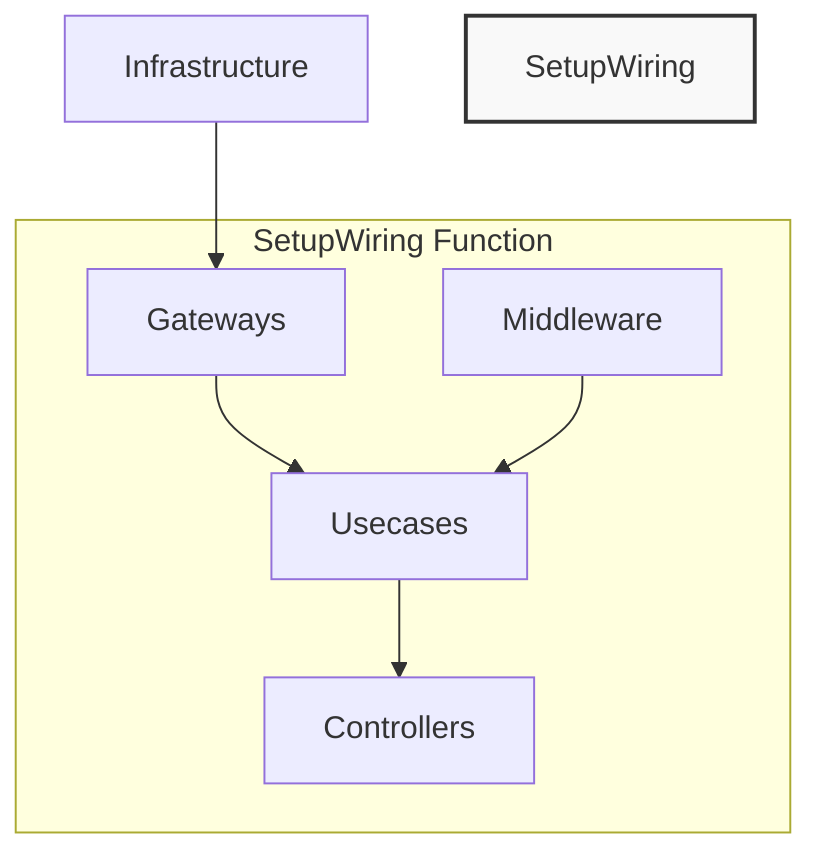

# Wiring Implementation

## Overview
Wiring is where all components are connected together. It handles dependency injection, middleware application, and the registration of controllers. Proper wiring ensures that usecases have access to the gateways they need and that controllers can access usecases.



## Wiring Location and Organization
- All wiring should be implemented in the `wiring/setup.go` file
- The `SetupWiring` function serves as the entry point for connecting all components
- Organize wiring to maximize gateway reuse across different usecases
- Consider initializing common gateways first, then usecases, then controllers

## ✅ REQUIRED
- Follow the component setup pattern (gateway → usecase → middleware → controller)
- Apply middleware in the correct order
- Use variable names that reflect component roles with middleware
- Include all dependencies required by usecases
- Add controllers to apiPrinter for documentation
- Organize gateways to enable sharing between usecases

## ❌ FORBIDDEN
- NEVER skip required middleware (transaction) for usecases with multiple write operations
- NEVER connect controllers directly to usecases without appropriate middleware
- NEVER create dependency cycles
- NEVER implement wiring outside the designated wiring package
- NEVER duplicate gateway instances when they can be shared

## 💡 MIDDLEWARE APPLICATION GUIDELINES
- **Transaction Middleware**: Apply ONLY when a usecase performs multiple database write operations
  - Located in `middleware/transaction.go`
  - Essential for maintaining data consistency
  - Should be the innermost middleware when multiple are used
- **Optional Middleware**: Apply only when specifically requested
  - Logging: For debugging and tracking execution flow
  - Timing: For measuring performance
  - Retry: For resilience against transient failures
- **Middleware Order**: When applying multiple middleware, follow this order:
  1. Logging (outermost)
  2. Timing
  3. Authorization/Authentication
  4. Validation
  5. Retry
  6. Transaction (innermost)

## 💡 IMPORTANT TO REMEMBER
- Wiring is where all components are integrated
- Gateway instances should be shared across usecases when possible
- Use descriptive variable names for usecases with middleware (e.g., `createUserWithTransaction`)
- Consider how to handle environment-specific configuration
- Plan initialization order to maximize resource sharing

## Component Initialization Order

The recommended initialization order is:

1. Infrastructure clients (database, message brokers, HTTP clients)
2. System utility gateways (UUID generation, time providers)
3. Domain gateways (database operations)
4. Usecases
5. Middleware-wrapped usecases
6. Controllers

This order ensures dependencies are available when needed and promotes code reuse.

## 📝 EXAMPLE

```go
// In wiring/setup.go
func SetupWiring(mux *http.ServeMux, db *gorm.DB, apiPrinter *utils.ApiPrinter) {
    // Initialize shared gateways first
    findUserByEmail := gateway.ImplFindUserByEmail(db)
    findUserByID := gateway.ImplFindUserByID(db)
    createUserDB := gateway.ImplCreateUserDB(db)
    updateUserDB := gateway.ImplUpdateUserDB(db)
    
    // Utility gateways
    generateUUID := gateway.ImplGenerateUUID()
    getCurrentTime := gateway.ImplGetCurrentTime()
    
    // Product gateways
    findProductByID := gateway.ImplFindProductByID(db)
    createProductDB := gateway.ImplCreateProductDB(db)
    
    // Initialize user usecases
    createUserUsecase := usecase.ImplCreateUser(
        findUserByEmail,  // Reused gateway
        generateUUID,     // Reused gateway 
        getCurrentTime,   // Reused gateway
        createUserDB      // Reused gateway
    )
    
    updateUserUsecase := usecase.ImplUpdateUser(
        findUserByID,     // Reused gateway
        getCurrentTime,   // Reused gateway
        updateUserDB      // Reused gateway
    )
    
    // Initialize product usecases
    createProductUsecase := usecase.ImplCreateProduct(
        findUserByID,     // Reused gateway from user domain
        generateUUID,     // Reused utility gateway
        getCurrentTime,   // Reused utility gateway
        createProductDB   // Product-specific gateway
    )
    
    // Apply middleware where needed
    createUserWithTransaction := middleware.Transaction(createUserUsecase, db)
    createProductWithTransaction := middleware.Transaction(createProductUsecase, db)
    
    // Register controllers
    apiPrinter.Add(controller.CreateUserController(mux, createUserWithTransaction))
    apiPrinter.Add(controller.UpdateUserController(mux, updateUserUsecase)) // No transaction needed
    apiPrinter.Add(controller.CreateProductController(mux, createProductWithTransaction))
}
```

## Multi-Environment Support

For applications that need to run in multiple environments (development, testing, production), consider parameterizing the `SetupWiring` function:

```go
func SetupWiring(mux *http.ServeMux, config Config, apiPrinter *utils.ApiPrinter) {
    // Connect to database based on environment
    db, err := connectToDatabase(config.DatabaseURL)
    if err != nil {
        log.Fatalf("Failed to connect to database: %v", err)
    }
    
    // Configure logging based on environment
    logger := setupLogger(config.LogLevel)
    
    // Setup rate limiting based on environment
    rateLimiter := setupRateLimiter(config.RateLimit)
    
    // Initialize gateways with environment-specific configurations
    // ...
    
    // Initialize usecases
    // ...
    
    // Apply middleware with environment-specific settings
    if config.EnableTransactionLogging {
        createUserWithLogging := middleware.Logging(createUserUsecase, logger)
        createUserWithTransaction := middleware.Transaction(createUserWithLogging, db)
        // Register controller with fully middleware-wrapped usecase
        apiPrinter.Add(controller.CreateUserController(mux, createUserWithTransaction))
    } else {
        // Basic middleware only
        createUserWithTransaction := middleware.Transaction(createUserUsecase, db)
        apiPrinter.Add(controller.CreateUserController(mux, createUserWithTransaction))
    }
    
    // ...
}
```

## Wiring for Testing

When setting up wiring for tests, you may want to create an alternative function that accepts mocks:

```go
// In testutil/mock_wiring.go
func SetupTestWiring(
    mockUserFindByEmail gateway.UserFindByEmail,
    mockUserCreate gateway.UserCreate,
    mockGenerateUUID gateway.SystemGenerateUUID,
) usecase.CreateUser {
    // Create usecase with mocked dependencies
    return usecase.ImplCreateUser(
        mockUserFindByEmail,
        mockUserCreate,
        mockGenerateUUID,
    )
}
```

This allows tests to provide mock implementations of gateways to test usecases in isolation.